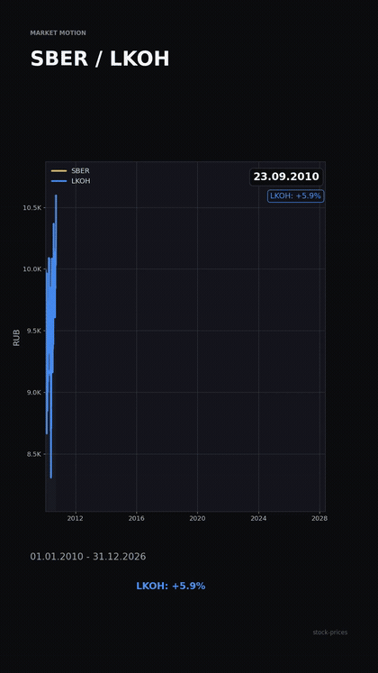
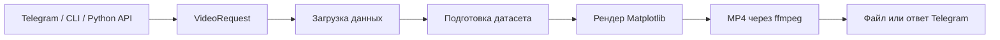

<section class="sp-hero">
  <div class="sp-hero__content">
    <span class="sp-kicker">Stock Prices</span>
    <h1>Видео с рыночными графиками по одному сообщению в Telegram</h1>
    <p>
      Проект загружает данные по российским и глобальным инструментам, строит
      стильный анимированный график и возвращает готовый MP4 через CLI,
      Python API или постоянно работающего Telegram-бота.
    </p>
    <div class="sp-actions">
      <a class="sp-button sp-button--primary" href="runbook/">Запустить локально</a>
      <a class="sp-button" href="docker/">Запустить в Docker</a>
      <a class="sp-button" href="demo/">Посмотреть возможности</a>
    </div>
  </div>
</section>

<div class="sp-badges">
  <span>MOEX</span>
  <span>Yahoo Finance</span>
  <span>Telegram Bot API</span>
  <span>Matplotlib</span>
  <span>Docker Compose</span>
</div>

## Пример результата

<figure class="sp-media">
  
  <figcaption>Ускоренный GIF из реального MP4: видно, как график SBER и LKOH постепенно строится по всей истории.</figcaption>
</figure>

## Что умеет проект

<div class="sp-grid">
  <a class="sp-card" href="demo/#поддерживаемые-рынки-и-активы">
    <strong>Много рынков</strong>
    <span>Российские акции, фьючерсы, валюты, иностранные акции, металлы, криптовалюты и индексы.</span>
  </a>
  <a class="sp-card" href="runbook/#6-проверить-запросы-из-telegram">
    <strong>Удобная работа через Telegram</strong>
    <span>Достаточно написать тикер и параметры: бот сам сделает видео и отправит MP4.</span>
  </a>
  <a class="sp-card" href="docker/">
    <strong>Постоянный запуск</strong>
    <span>Docker-контейнер держит бота онлайн и автоматически перезапускается.</span>
  </a>
  <a class="sp-card" href="reference/api/">
    <strong>Единый pipeline</strong>
    <span>CLI, Telegram и Python API используют общий `generate_video()` без дублирования логики.</span>
  </a>
</div>

## Быстрый старт

=== "Docker"

    ```powershell
    copy .env.example .env
    docker compose up -d --build
    docker compose ps
    ```

=== "CLI"

    ```powershell
    python -m pip install -e .
    python -m stock_prices --tickers "SBER|stock|shares" "LKOH|stock|shares" --start_date 2020-01-01 --end_date 2024-12-31
    ```

=== "Telegram"

    ```text
    SBER LKOH 2020 2024
    AAPL global USD gradient
    BTC price duration=12 fps=24
    ```

## Основные разделы

<div class="sp-grid sp-grid--small">
  <a class="sp-card" href="demo/">
    <strong>Демонстрация</strong>
    <span>Возможности, архитектура, рынки, примеры и сценарий показа проекта.</span>
  </a>
  <a class="sp-card" href="runbook/">
    <strong>Запуск и проверка</strong>
    <span>Пошаговый runbook для Windows/PowerShell, CLI, Telegram и диагностики.</span>
  </a>
  <a class="sp-card" href="docker/">
    <strong>Docker</strong>
    <span>Постоянный Telegram-бот, volume mounts, healthcheck и типовые ошибки.</span>
  </a>
  <a class="sp-card" href="reference/api/">
    <strong>API</strong>
    <span>Публичные Python-точки входа для интеграции генерации видео.</span>
  </a>
</div>

## Поддерживаемые запросы

```text
LKOH
SBER LKOH 2020 2024
AAPL global USD gradient
gold 2018-2026 USD gradient
BTC-USD global crypto close
SiH4 futures 2024 close
USD000UTSTOM selt 2024 close
```

## Как устроено


