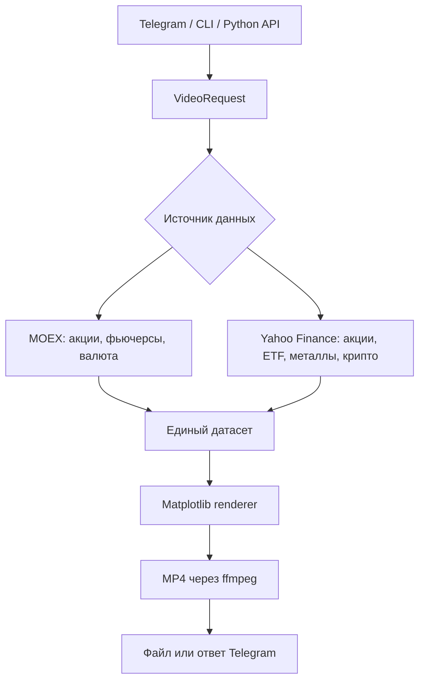

<section class="sp-hero">
  <div class="sp-hero__content">
    <span class="sp-kicker">Документация</span>
    <h1>Stock Prices</h1>
    <p>
      Генератор MP4-видео с анимированными рыночными графиками. Можно запустить
      из CLI, встроить через Python API или держать постоянно работающего
      Telegram-бота в Docker или открыть Mini App для сборки запроса кнопками.
    </p>
    <div class="sp-actions">
      <a class="sp-button sp-button--primary" href="#быстрый-старт">Быстрый старт</a>
      <a class="sp-button" href="telegram/">Telegram-запросы</a>
      <a class="sp-button" href="docker/">Docker</a>
    </div>
  </div>
</section>

<div class="sp-badges">
  <span>MOEX</span>
  <span>Yahoo Finance</span>
  <span>Telegram Bot API</span>
  <span>Python API</span>
  <span>Docker Compose</span>
</div>

## Что получится

<figure class="sp-media">
  
  <figcaption>Ускоренный GIF из реального MP4: шкала времени стабильная, а линия, градиент и подписи движутся синхронно.</figcaption>
</figure>

## Быстрый старт

Выберите вход, который нужен прямо сейчас. Для постоянного Telegram-бота удобнее Docker; для локальной проверки быстрее CLI.

=== "Docker"

    ```powershell
    copy .env.example .env
    # Заполните TELEGRAM_BOT_TOKEN в .env
    docker compose up -d --build
    docker compose ps
    ```

    После запуска откройте Telegram и отправьте боту `/start`.

=== "CLI"

    ```powershell
    python -m pip install -e .
    python -m stock_prices --tickers "SBER|stock|shares" "LKOH|stock|shares" --start_date 2020-01-01 --end_date 2024-12-31 --currency RUB --duration 20 --fps 20
    ```

    Готовый MP4 появится в `animations/`.

=== "Telegram"

    ```text
      /start
      /app
      /shoot
      /shorts
    /shorts SBER LKOH за год
    /queue
    ```

    Бот не использует LLM: `/app` открывает Mini App, `/shorts` принимает ручной запрос, `random` и недельный план собираются из тикерной вселенной, а запрос с тикерами ставит в очередь конкретный ролик.

## Куда идти дальше

<div class="sp-grid sp-grid--small">
  <a class="sp-card" href="runbook/">
    <strong>Запуск и проверка</strong>
    <span>Локальная установка, smoke-проверки, Telegram token, chat id и диагностика.</span>
  </a>
  <a class="sp-card" href="telegram/">
    <strong>Telegram-запросы</strong>
    <span>Кнопки, короткий синтаксис, свои ролики, готовые истории и параметры.</span>
  </a>
  <a class="sp-card" href="docker/">
    <strong>Docker</strong>
    <span>Постоянный бот, volume mounts, healthcheck, логи и типовые ошибки.</span>
  </a>
  <a class="sp-card" href="demo/">
    <strong>Демонстрация</strong>
    <span>Возможности, рынки, примеры роликов и сценарий показа проекта.</span>
  </a>
  <a class="sp-card" href="reference/api/">
    <strong>Python API</strong>
    <span>Публичные точки входа для интеграции генерации видео.</span>
  </a>
</div>

## Telegram без перегруза

| Хочу | Что отправить |
| --- | --- |
| Открыть Mini App | `/app` |
| Открыть рабочий пульт | `/start`, `/menu`, `/shoot` или `снять` |
| Выбрать готовую историю | `/shorts` или кнопка `Истории` |
| Случайная подборка | кнопка `Random`, `random mixed 1`, `random mixed 3`, `random drama 2`, `random stocks 2` |
| Недельный план | `/plan` или `/publish_week` |
| Снять ролик по тикерам | `/shorts SBER LKOH за год` |
| Проверить долгий рендер | `/queue`, `статус` или кнопка `Очередь` |
| Открыть справку | `/help` |

Обычные строки вроде `LKOH`, `SBER LKOH 2020 2024` и `AAPL global USD shorts` тоже работают. Несколько роликов можно отправить одним сообщением: один запрос на строку.

Полный справочник лежит в разделе [Telegram-запросы](telegram.md).

## Как устроено


```mermaid
flowchart TD
  User["Telegram / CLI / Python API"] --> Request["VideoRequest"]
  Request --> Sources{"Источник данных"}
  Sources --> Moex["MOEX: акции, фьючерсы, валюта"]
  Sources --> Global["Yahoo Finance: акции, ETF, металлы, крипто"]
  Moex --> Dataset["Единый датасет"]
  Global --> Dataset
  Dataset --> Render["Matplotlib renderer"]
  Render --> Video["MP4 через ffmpeg"]
  Video --> Output["Файл или ответ Telegram"]
```
